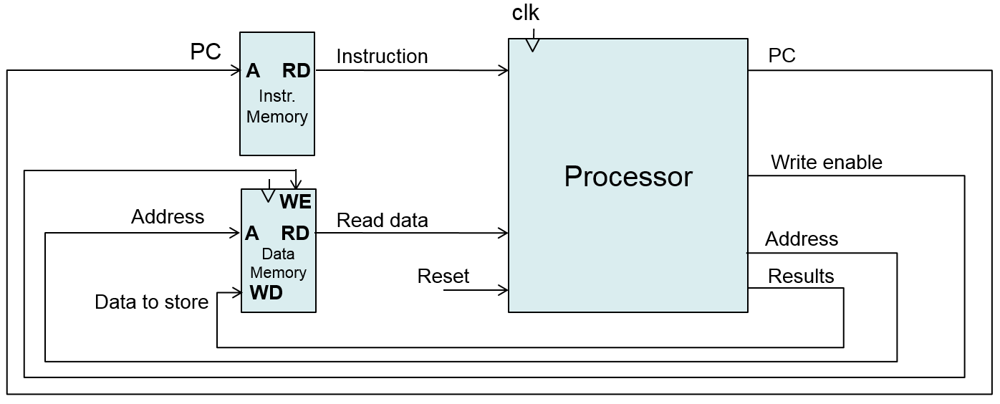
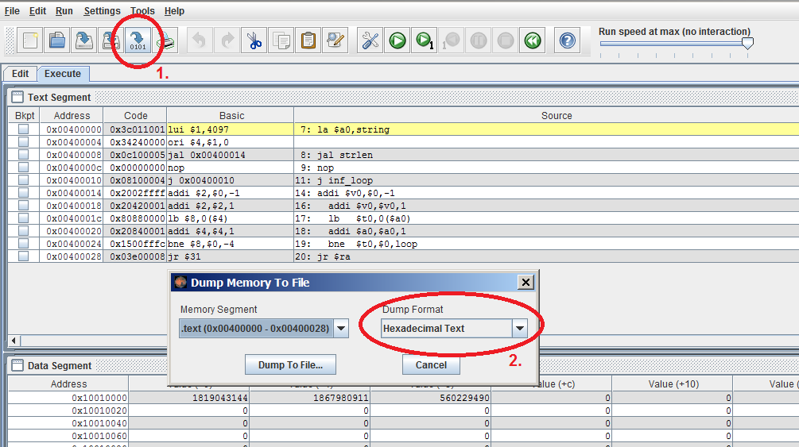

# " SINGLE-CYCLE CPU DESIGN " 

Design a simple 32-bit processor connected to a separate instruction and data memory. The processor has to implement instructions given in the table bellow. Suppose that the processor starts the execution from the beginning of instruction memory (0x00000000).

#### Program S

Write a program called S in the RISC-V assembly language that sorts a certain index of memory locations

###### Important:

Include the Verilog description only for the CPU. Do not include the description of other components (data memory, instruction memory, etc.).

Use the following template:

    `default_nettype none
    module processor( input         clk, reset,
                      output [31:0] PC,
                      input  [31:0] instruction,
                      output        WE,
                      output [31:0] address_to_mem,
                      output [31:0] data_to_mem,
                      input  [31:0] data_from_mem
                    );
        //... write your code here ...
    endmodule

    //... add new Verilog modules here ...
    `default_nettype wire

You can use the MARS simulator to generate the machine code of program S. See figure bellow. Note: MARS implements RISC-V ISA, which slightly differs from picoMIPS ISA - see the definition of instructions described above (there is no addu.qb instruction).

You can use the following Verilog modules to represent the whole computer system. If the data and instruction memory arrays of vectors are not large enough, extend them. However, please **do not** include them into the **Surname\_FirstName\_CPU.v** file.

    module top (    input         clk, reset,
            output [31:0] data_to_mem, address_to_mem,
            output        write_enable);

        wire [31:0] pc, instruction, data_from_mem;

        inst_mem  imem(pc[7:2], instruction);
        data_mem  dmem(clk, write_enable, address_to_mem, data_to_mem, data_from_mem);
        processor CPU(clk, reset, pc, instruction, write_enable, address_to_mem, data_to_mem, data_from_mem);
    endmodule

    //-------------------------------------------------------------------
    module data_mem (input clk, we,
             input  [31:0] address, wd,
             output [31:0] rd);

        reg [31:0] RAM[63:0];

        initial begin
            $readmemh ("memfile_data.hex",RAM,0,63);
        end

        assign rd=RAM[address[31:2]]; // word aligned

        always @ (posedge clk)
            if (we)
                RAM[address[31:2]]<=wd;
    endmodule

    //-------------------------------------------------------------------
    module inst_mem (input  [5:0]  address,
             output [31:0] rd);

        reg [31:0] RAM[63:0];
        initial begin
            $readmemh ("memfile_inst.hex",RAM,0,63);
        end
        assign rd=RAM[address]; // word aligned
    endmodule

And for the simulation, you can use the following template:

    module testbench();
        reg         clk;
        reg         reset;
        wire [31:0] data_to_mem, address_to_mem;
        wire        memwrite;

        top simulated_system (clk, reset, data_to_mem, address_to_mem, write_enable);

        initial begin
            $dumpfile("test");
            $dumpvars;
            reset<=1; # 2; reset<=0;
            #100; $finish;
        end

        // generate clock
        always  begin
            clk<=1; # 1; clk<=0; # 1;
        end
    endmodule
